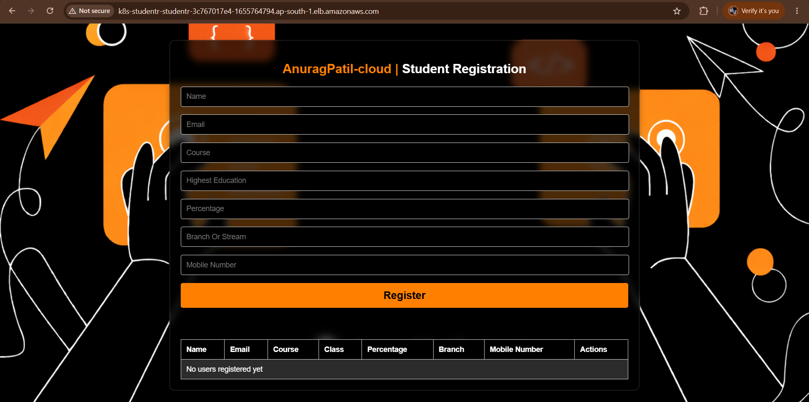
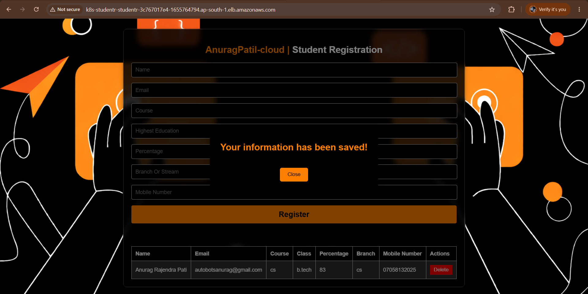
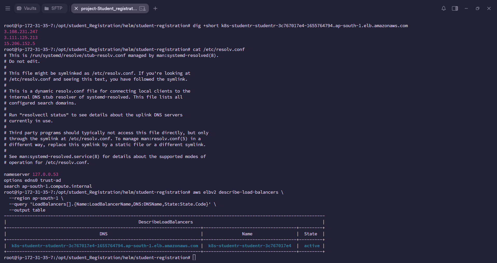
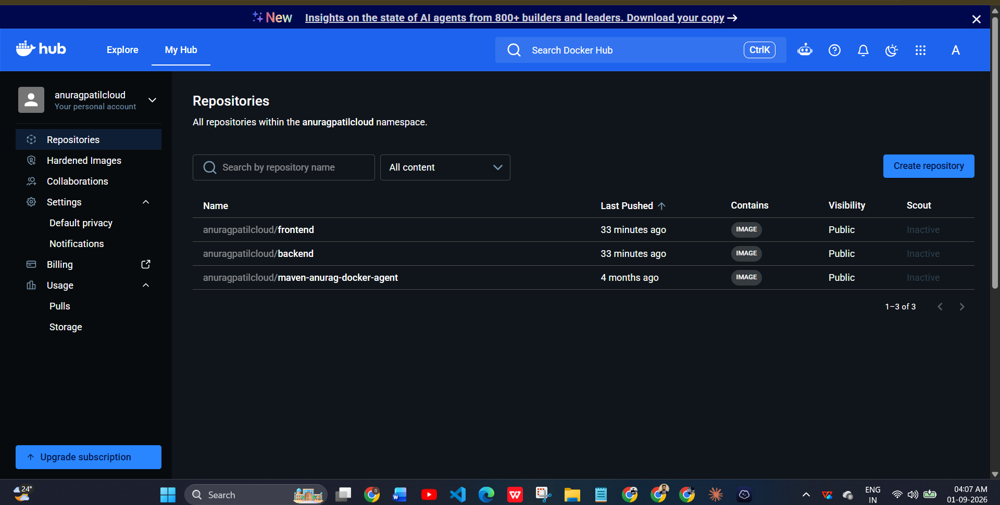
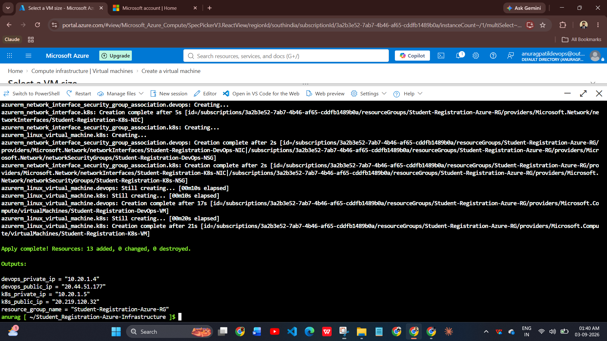
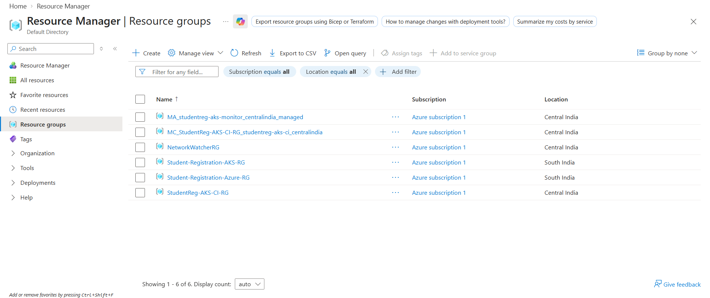
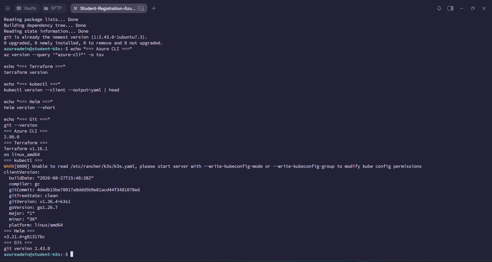
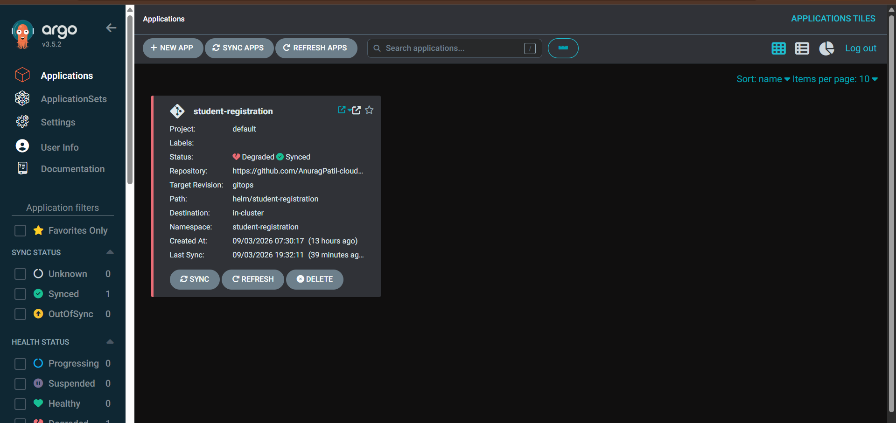
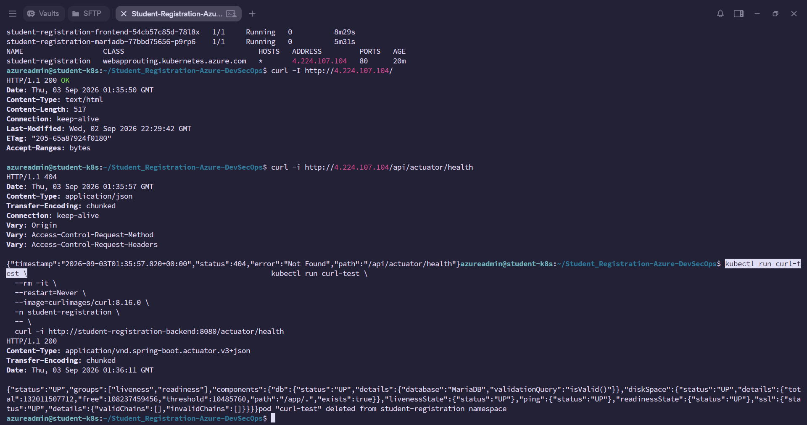
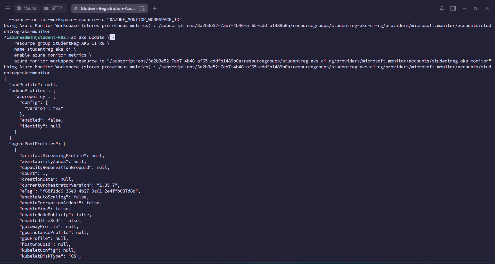

# 🎓 Student Registration — Multi-Cloud DevSecOps (AWS + Azure)

A production-style **Student Registration** application deployed across **AWS and Microsoft Azure** using a shared application codebase and cloud-specific infrastructure/deployment layers.

> **React → Spring Boot → Docker → Jenkins → SonarQube/Trivy → Docker Hub → Kubernetes → Argo CD → AWS EKS + Azure AKS → Cloud-native ingress & monitoring**

## ☁️ What makes this project Multi-Cloud?

| Layer | AWS | Azure |
|---|---|---|
| Kubernetes | Amazon EKS | Azure AKS |
| Ingress | AWS Load Balancer Controller / ALB | Azure Application Routing |
| Database | Amazon RDS for MariaDB | MariaDB deployed in Kubernetes in the supplied project |
| IaC | Terraform | Terraform |
| CI | Jenkins | Jenkins |
| Security | SonarQube + Trivy | SonarQube + Trivy |
| Registry | Docker Hub | Docker Hub |
| GitOps | Argo CD | Argo CD |
| Monitoring evidence | CloudWatch / cluster metrics | Azure Monitor + Managed Prometheus + Grafana |

The **application source is shared**. Cloud-specific Terraform, Helm and GitOps definitions are isolated under `infrastructure/` and `deploy/`.

## 🏗️ Architecture

See the full diagram in [`docs/ARCHITECTURE.md`](docs/ARCHITECTURE.md).

```text
                         GitHub
                           │
                           ▼
                     ┌───────────┐
                     │  Jenkins  │
                     └─────┬─────┘
                           │
             ┌─────────────┼─────────────┐
             ▼             ▼             ▼
          Tests        SonarQube       Trivy
             └─────────────┼─────────────┘
                           ▼
                       Docker Hub
                    ┌──────┴──────┐
                    ▼             ▼
                AWS EKS        Azure AKS
                    │             │
                 ALB/Ingress   App Routing
                    │             │
                  Users         Users
                    │             │
               RDS MariaDB   MariaDB in AKS
```

## 🧰 Technology Stack

- **Frontend:** React, Vite
- **Backend:** Java 17+, Spring Boot, Maven
- **Database:** MariaDB
- **Containers:** Docker
- **Orchestration:** Kubernetes, Amazon EKS, Azure AKS
- **CI/CD:** Jenkins, Argo CD
- **Security:** SonarQube, Trivy
- **IaC:** Terraform
- **Registry:** Docker Hub
- **Monitoring:** AWS CloudWatch/cluster metrics, Azure Monitor, Managed Prometheus and Grafana

## 📁 Repository Structure

```text
Student-Registration-MultiCloud/
├── backend/                         # Shared Spring Boot application
├── frontend/                        # Shared React application
├── Jenkinsfile                      # DevSecOps CI baseline
├── ci/
│   ├── aws/Jenkinsfile              # Original AWS pipeline
│   └── azure/Jenkinsfile            # Original Azure pipeline
├── infrastructure/
│   ├── aws/terraform/               # AWS VPC + EKS + RDS Terraform
│   └── azure/bootstrap-vm/           # Azure Terraform bootstrap infrastructure
├── deploy/
│   ├── helm/
│   │   ├── aws/                     # EKS/ALB Helm variant
│   │   └── azure/                   # AKS/Azure-routing Helm variant
│   └── argocd/
│       ├── aws/                     # AWS GitOps definitions
│       └── azure/                   # Azure GitOps definitions
├── docs/
│   ├── ARCHITECTURE.md
│   ├── DEPLOYMENT.md
│   └── screenshots/
│       ├── aws/
│       └── azure/
└── .gitignore
```

## 🚀 CI/CD Flow

1. Developer pushes code to GitHub.
2. Jenkins checks out the repository.
3. Backend tests and frontend validation run.
4. SonarQube performs code-quality analysis.
5. Docker images are built.
6. Trivy scans container images for high/critical vulnerabilities and secrets.
7. Images are pushed to Docker Hub.
8. Helm image tags are updated for GitOps.
9. Argo CD synchronizes the selected Kubernetes environment.
10. The same application is available on EKS and AKS.

## 📸 Deployment Evidence — AWS

### Application running on AWS



### Registration successfully submitted



### AWS ALB exists



### Kubernetes deployment


### Docker Hub repositories



### SonarQube quality gate


## 📸 Deployment Evidence — Azure

### Terraform infrastructure



### Azure resource groups



### Kubernetes/DevOps environment



### Jenkins pipeline


### Argo CD application



### Application verified on AKS



### Managed Prometheus



### Grafana monitoring — HTTP status distribution


## 🔐 Security Practices

- Terraform state and variable files are excluded from Git.
- Real credentials and secrets must be supplied through secure CI/CD or cloud secret mechanisms.
- Container images are scanned with Trivy.
- Backend code is analyzed with SonarQube.
- Kubernetes probes are configured for application health.
- Database services are not intentionally exposed publicly.
- SSH private keys, `.env` files and generated artifacts are ignored.

## 🧪 Local Development

### Backend

```bash
cd backend
./mvnw clean test
./mvnw spring-boot:run
```

### Frontend

```bash
cd frontend
npm ci
npm run dev
```

Configure the frontend API endpoint through the existing Vite environment/build configuration.

## 📚 Deployment Documentation

- [`docs/ARCHITECTURE.md`](docs/ARCHITECTURE.md)
- [`docs/DEPLOYMENT.md`](docs/DEPLOYMENT.md)
- [`deploy/helm/README.md`](deploy/helm/README.md)

## 🎯 Resume / LinkedIn Project Summary

**Multi-Cloud Student Registration Platform — AWS & Azure**

> Designed and deployed a cloud-native Student Registration platform across AWS EKS and Azure AKS using a shared React/Spring Boot application. Automated infrastructure with Terraform, containerized workloads with Docker, implemented Jenkins CI with SonarQube and Trivy security gates, and used Helm + Argo CD for Kubernetes/GitOps delivery. Integrated AWS RDS MariaDB and Azure Kubernetes database deployment, with cloud-native ingress and monitoring through AWS CloudWatch and Azure Monitor/Prometheus/Grafana.

## 👨‍💻 Author

**Anurag Patil**

DevOps Engineer | AWS | Azure | Kubernetes | Docker | Terraform | Jenkins | Argo CD | CI/CD | DevSecOps

---

**Important:** This repository combines the supplied AWS and Azure project artifacts into one multi-cloud portfolio project. The screenshots are the original deployment evidence supplied with those projects; no synthetic deployment screenshots were created.
