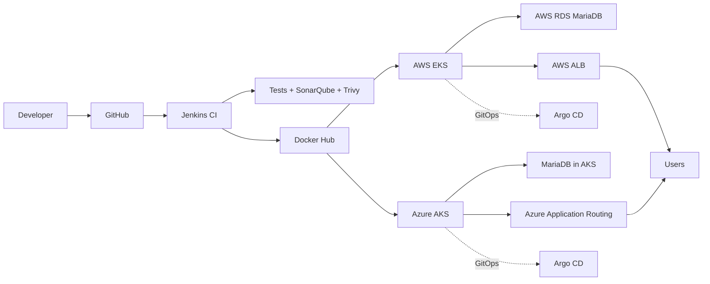

# Multi-Cloud Architecture

## Design

- **One application codebase:** React frontend + Spring Boot backend.
- **One container workflow:** Docker images are built and security-scanned in CI.
- **Two Kubernetes targets:** AWS EKS and Azure AKS.
- **Infrastructure as Code:** Terraform is separated into cloud-specific directories.
- **GitOps:** Argo CD manifests are separated for AWS and Azure.
- **Cloud-native ingress:** AWS uses ALB-oriented ingress; Azure uses Azure application routing.
- **Database strategy:** the supplied AWS deployment uses RDS MariaDB; the supplied Azure deployment uses MariaDB in Kubernetes.
- **Observability:** the Azure project includes Managed Prometheus/Grafana evidence; the AWS project includes CloudWatch/cluster monitoring evidence.

This structure makes the project genuinely multi-cloud without pretending that AWS and Azure use identical managed services.
